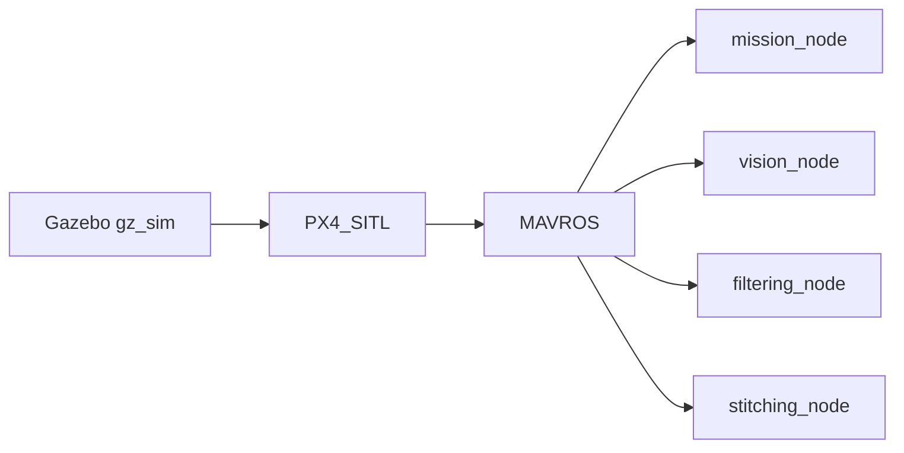
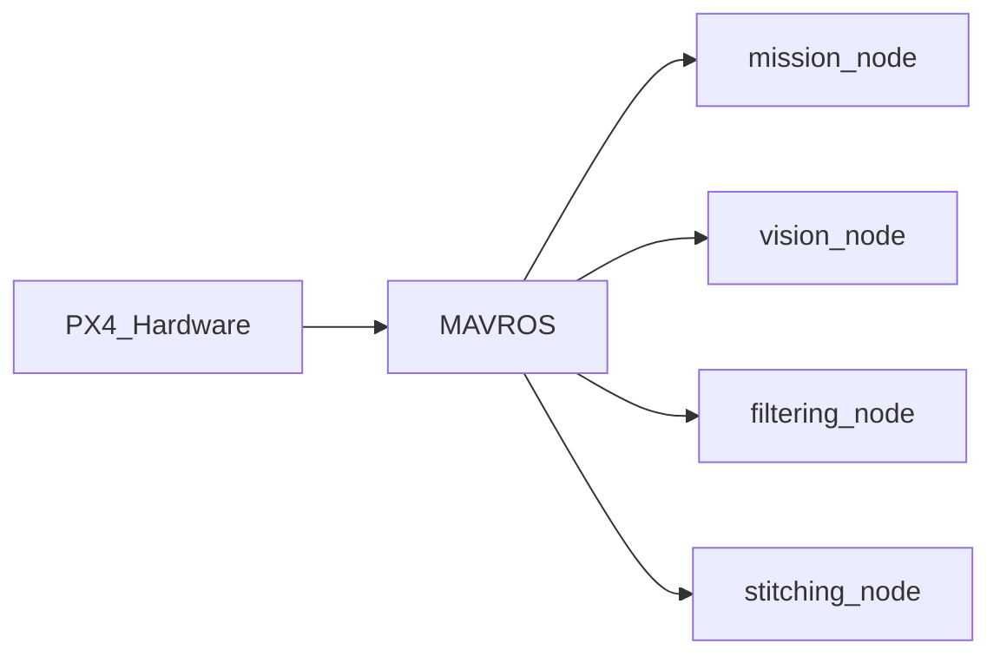
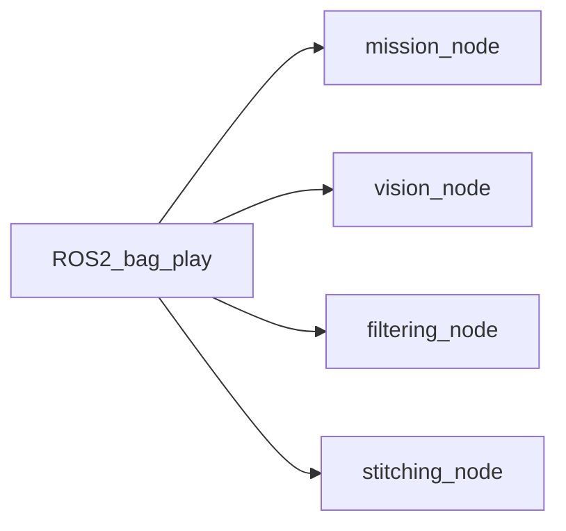
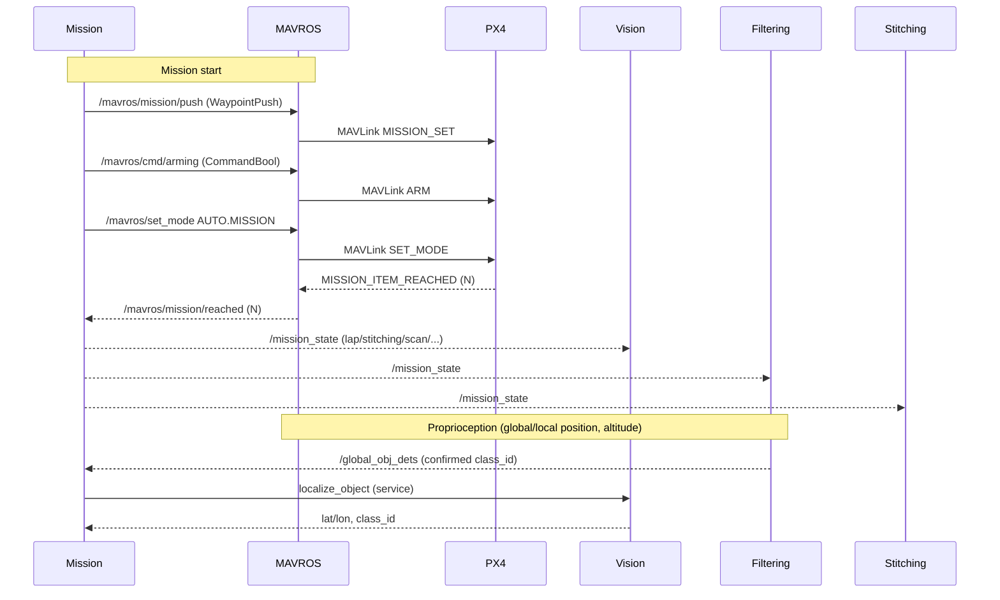

# Buckeye Vertical Core (ROS 2)

End-to-end autonomy stack for BV missions: mission control, vision-based detection, geolocation/filtering, and stitching, integrated with PX4 via MAVROS.

## Introduction

This package orchestrates an autonomous mission with PX4:
- Mission node pushes waypoints, arms, and switches to AUTO.MISSION.
- Vision node captures frames during scan legs, runs RF-DETR, and publishes detections.
- Filtering node fuses detections with pose/GPS to estimate object lat/lon and serves them to Mission.
- Stitching node captures images at waypoints to build an aerial map.

## Project Structure

Below is the project structure for the ROS workspace directory (e.g. bv_ws). In ROS the common paradigm is to house all packages under `src`. bv_core (this repo) and [bv_msgs](https://github.com/BuckeyeVertical/bv_msgs) are cloned in `src`.

```
bv_ws
├── annotated_frames
├── build
├── install
├── log
├── logs
├── PX4-Autopilot
├── rf-detr-base.pth
└── src
    ├── bv_core
    └── bv_msgs
```

If you need to build packages from source (if sudo apt install if failing), then you should clone their repos in the src directory. Below is an example of building mavros from source.

```
bv_ws
├── annotated_frames
├── build
├── install
├── log
├── rf-detr-base.pth
└── src
    ├── bv_core
    ├── bv_msgs
	├── mavros
    ├── mavros_extras
    ├── mavros_msgs
    └── test_mavros
```


## Architecture

### Nodes and interfaces

High-level services (“microservices”) and data flow:

- **mission_node** (bv_core.mission.MissionRunner)
	- Publishes: `/mission_state` (std_msgs/String), `/deployed_object_locations` (bv_msgs/ObjectLocations)
	- Subscribes: `/mavros/mission/reached` (mavros_msgs/WaypointReached), `/mavros/state` (mavros_msgs/State), `/mavros/global_position/global` (NavSatFix), `/global_obj_dets` (std_msgs/Int8)
	- Calls services: `/mavros/mission/push` (WaypointPush), `/mavros/cmd/arming` (CommandBool), `/mavros/set_mode` (SetMode), `/mavros/cmd/command` (CommandLong), `/mavros/param/set` (ParamSetV2), `localize_object` (bv_msgs/srv/LocalizeObject) on vision_node
	- Role: Mission FSM (takeoff → lap → scan → localize → deliver → deploy → return). Pushes waypoints from `config/mission_params.yaml`, tunes speed via `MPC_XY_VEL_ALL`, controls servos via PX4 PWM params. On confirmed detections from `/global_obj_dets`, calls `localize_object` to get GPS, then flies to object and deploys payload.

- **vision_node** (bv_core.vision_node.VisionNode)
	- Publishes: `/obj_dets` (bv_msgs/ObjectDetections), `/queue_state` (std_msgs/Int8)
	- Subscribes: `/mission_state` (String), `/mavros/mission/reached` (WaypointReached), `/mavros/global_position/global` (NavSatFix), `/mavros/local_position/pose` (PoseStamped), `/mavros/global_position/rel_alt` (Float64)
	- Provides: `localize_object` (bv_msgs/srv/LocalizeObject) — captures a frame, runs detection, returns lat/lon and class for the requested object
	- Role: Image input comes from a configurable pipeline (sim/real/ros per `vision_params.yaml`), not from a ROS image topic. On scan state, enqueues frames at waypoint-reached events, runs RF-DETR in batches, publishes detections. Mission calls `localize_object` during localize state to get object coordinates.

- **filtering_node** (bv_core.filtering_node.FilteringNode)
	- Publishes: `/global_obj_dets` (std_msgs/Int8) — confirmed class IDs after 3-frame consistency, excluding areas near already-deployed locations
	- Subscribes: `/obj_dets` (bv_msgs/ObjectDetections), `/mavros/global_position/global` (NavSatFix), `/mavros/global_position/rel_alt` (Float64), `/mavros/local_position/pose` (PoseStamped), `/mission_state` (String), `/deployed_object_locations` (bv_msgs/ObjectLocations)
	- Role: Time-aligns detections with pose/GPS, projects to lat/lon using camera intrinsics/orientation from `filtering_params.yaml`. Confirms detections in scan state and publishes `/global_obj_dets`; does not provide a service — mission uses `localize_object` on vision_node for per-object GPS.

- **stitching_node** (bv_core.stitching.ImageStitcherNode)
	- Subscribes (ROS): `/mission_state` (String), `/mavros/mission/reached` (WaypointReached)
	- Image input: Gazebo transport topic via `GzTransportPipeline` (param `image_topic`, default `/world/baylands/.../camera/image`), not `/image_raw`
	- Role: Captures at waypoints during stitching state, runs OpenCV stitcher, saves panoramas to disk (no ROS image subscription).

- **bv_viz_node** (bv_core.bv_viz_node.DroneVizNode)
	- Publishes: `/viz/markers` (visualization_msgs/MarkerArray) — drone pose, path, waypoints, HUD (mission state, queue state)
	- Subscribes (params): `/mavros/local_position/pose`, `/mavros/global_position/global`, `/mission_state`, `/queue_state`, `/mavros/mission/reached`, `/mavros/mission/waypoints`
	- Note: `dets_topic` is declared for `/obj_dets` but no subscription is created in the current implementation, so detection markers are not updated.

Launch file: `launch/mission.launch.py` starts mission_node, vision_node, filtering_node, and bv_viz_node; stitching_node is present in the file but commented out.

#### Test and utility nodes

- **camera_pipeline_test_node** — Publishes `/image_raw` (sensor_msgs/Image) from a GStreamer pipeline for debugging; not part of the main mission flow.
- **test_obj_loc** — Provides `get_object_locations` (bv_msgs/srv/GetObjectLocations) with canned locations from `config/test_obj_loc.yaml`; legacy/test only, not used by mission_node (mission uses `localize_object` on vision_node).
- **test_servo** — Calls `/mavros/cmd/command` (CommandLong CMD_DO_SET_SERVO) for quick servo PWM tests.
- **gimbal_stabilizer_node** — Simulation-only helper: uses Gazebo transport (IMU → gimbal roll/pitch commands), no ROS 2 topics; run manually if needed for SITL gimbal stabilization.

### Operating modes overview

Two inputs feed the ROS 2 nodes: flight data (/mavros/*) and images (/image_raw). The mode you choose controls where those inputs come from.

SITL (simulation) — Gazebo + PX4 SITL + MAVROS


HITL/On-vehicle — PX4 hardware + MAVROS


ROS bag playback — offline analysis/replay


Notes
- In SITL/HITL, images can come from a real camera via gscam2, or from a simulator camera plugin.
- In ROS bag mode, you can replay either full flight+image topics or just images while running MAVROS live.

### Mission flow (PX4 + MAVROS + ROS 2)



## Setup

### Option 1: Linux Method

Prerequisites (Ubuntu 22.04 LTS recommended; typical dev machine or Jetson):
- [ROS 2 Humble](https://docs.ros.org/en/humble/Installation/Ubuntu-Install-Debs.html)
- [GeographicLib](https://geographiclib.sourceforge.io/C++/doc/index.html)
- [PX4_Autopilot](https://docs.px4.io/main/en/dev_setup/dev_env_linux_ubuntu.html) use --no-nuttx when running the script
- download Render_CAD.stl into meshes/ folder [Render_CAD.STL](https://buckeyemailosu-my.sharepoint.com/:u:/g/personal/clute_25_buckeyemail_osu_edu/EcOCPRC-NQFAmV3IplgyZxwBzP3rijvungflwU5AE4Jchw?e=PTFW1S)
- Python 3.10+ with CUDA-capable GPU recommended for RF-DETR.

Make sure you have followed the instructions in the linked pre-req websites
Clone PX4 in bv_ws
```bash
touch ~/bv_ws/PX4-Autopilot/COLCON_IGNORE
```
Clone the repos:
```bash
cd ~/bv_ws
mkdir src
cd src
# clone the two repos into src
git clone https://github.com/BuckeyeVertical/bv_core.git
git clone https://github.com/BuckeyeVertical/bv_msgs.git
cd ..
```

Install python deps (setup a venv... I recommend uv):
```bash
cd src/bv_core
pip install -r requirements.txt
```
```bash
sudo apt install -y \
  libgz-transport13-dev \
  libgz-msgs10-dev \
  python3-gz-transport13 \
  python3-gz-msgs10
sudo apt install ros-humble-cv-bridge ros-humble-foxglove-bridge
sudo apt install python3-colcon-common-extensions -y
```
Read file src/bv_core/meshes/ and replace it with the stl

Install mavros:
```bash
sudo apt install ros-humble-mavros
```
*Note: If MAVROS installation doesn't work, you can build it from source by cloning the MAVROS package into your ros workspace.*


```bash
sudo apt install geographiclib-tools libgeographic-dev
sudo /opt/ros/humble/lib/mavros/install_geographiclib_datasets.sh
```
*Note2: If you are facing issues with being told to run `install_geographiclib_dataset.sh`:*
```bash
# Then copy the geoid file to the correct location
sudo mkdir -p /usr/share/GeographicLib/geoids
sudo cp /usr/local/share/GeographicLib/geoids/egm96-5.pgm    /usr/share/GeographicLib/geoids/
```

Build and install:
1) Source your ROS 2 and MAVROS environment.
2) Install Python packages in your workspace venv if desired.
3) From the workspace root (`bv_ws`): build and source.

Typical commands (adjust distro/paths as needed):
```bash

# From your ROS 2 workspace root (one above src/)
source /opt/ros/humble/setup.bash
colcon build
source install/local_setup.bash
```


### Option 2: Docker Method

Follow these steps from the workspace root (`bv_ws`) to build and run the Docker development image:
Prereq: Install and set up Docker Desktop and leave the application open

1. Create the directories and clone the packages into `src`:

```bash
cd ~/bv_ws
mkdir src
git clone --recursive https://github.com/PX4/PX4-Autopilot.git
touch PX4-Autopilot/COLCON_IGNORE
cd src
# clone the two repos into src
git clone https://github.com/BuckeyeVertical/bv_core.git
git clone https://github.com/BuckeyeVertical/bv_msgs.git
```

3. Build the image from the workspace root:
```bash
cd ~/bv_ws/src/bv_core/container
docker build -f Dockerfile.<ARCH> -t <IMAGE_NAME>:<TAG> .
```

For arm:
```bash
docker build -f Dockerfile.arm -t bv_img:arm .
```

For x86:
```bash
docker build -f Dockerfile.x86 -t bv_img:x86 .
```

4. Run the container interactively:
```bash
./run_docker.sh <IMAGE_NAME>
bash ./PX4-Autopilot/Tools/setup/ubuntu.sh --no-nuttx
```

## How to run

Single system run (PX4 + MAVROS already running):
```bash
ros2 launch bv_core mission.launch.py
```

Individual nodes (for testing):
```bash
ros2 run bv_core mission_node
ros2 run bv_core vision_node
ros2 run bv_core filtering_node
ros2 run bv_core stitching_node
```
Download a rosbag from the [onedrive folder](https://buckeyemailosu.sharepoint.com/:f:/s/BuckeyeVerticaltheOhioStateUniversity/EjHddej_GGVGv54oig7Kb9QBrhaEMFVCkAXSl5aEFiD1Lw?e=GxnkYa)

```bash
ros2 bag play <bag_path>
```

[*Learn more about ros bags.*](https://docs.ros.org/en/foxy/Tutorials/Beginner-CLI-Tools/Recording-And-Playing-Back-Data/Recording-And-Playing-Back-Data.html)

To run foxglove:
```bash
ros2 launch foxglove_bridge foxglove_bridge_launch.xml port:=8765
```

## Simulation (SITL) and vehicle setup

Environment and build (all terminals):
```bash
cd ~/bv_ws
source /opt/ros/humble/setup.bash
source install/local_setup.bash
colcon build
```

PX4 SITL (from PX4-Autopilot repo root):
```bash
# Gazebo plugin path (adjust to your PX4-Autopilot location)
export GZ_SIM_SYSTEM_PLUGIN_PATH=$GZ_SIM_SYSTEM_PLUGIN_PATH:~/workspace/PX4-Autopilot/Tools/simulation/gz/plugins/build/gimbal_stabilizer

# PX4 simulation defaults
export PX4_GZ_WORLD=baylands
export PX4_HOME_LAT=38.3876112
export PX4_HOME_LON=-76.4190542
export PX4_HOME_ALT=0
export PX4_GZ_MODEL_POSE=0,0,0,0,0,0

# once px4 is running
# in the same terminal
param set NAV_DLL_ACT 0
```
Note: If you get ModuleNotFoundError: No module named 'menuconfig', run python3 -m pip install -r Tools/setup/requirements.txt from the PX4-Autopilot directory.

More on Gazebo (gz) simulation configuration and usage:
- https://docs.px4.io/main/en/sim_gazebo_gz/

MAVROS launch for simulation (SITL):
```bash
ros2 launch mavros px4.launch \
	fcu_url:=udp://:14540@localhost:14580 \
	gcs_url:=udp://@localhost:14555
```

MAVROS launch on vehicle (serial FCU):
```bash
ros2 launch mavros px4.launch \
	fcu_url:=serial:///dev/ttyUSB0:921600 \
	gcs_url:=udp://@0.0.0.0:14550
```

Optional: set PX4 home coordinates for SITL before launch:
```bash
export PX4_HOME_LAT=40.0985384
export PX4_HOME_LON=-83.1932462
```

Start the mission stack:
```bash
# single launch
ros2 launch bv_core mission.launch.py

# or run only the mission node
ros2 run bv_core mission_node
```

## SITL Camera Setup (Gazebo + ros_gz_bridge)

This section walks through running PX4 SITL with a monocular down-facing camera in Gazebo (gz) and bridging the simulator camera into ROS 2 using `ros_gz_bridge`.

Prerequisites
- A working PX4-Autopilot checkout (we use [BuckeyeVertical/PX4-gazebo-models] for custom worlds). If you already have PX4 cloned, skip cloning.
- `ros_gz_bridge` (part of the `ros_gz` repository) built for the Humble branch.
- `colcon`, `ros2` (Humble) and `gz` (Ignition/Gazebo) toolchain installed.

1) Prepare PX4 and world files

- Clone or update PX4 world assets (if you use our repo):

```bash
# If you don't already have PX4 worlds from the BuckeyeVertical repo
# Follow steps in the readme of this repo
git clone https://github.com/BuckeyeVertical/PX4-gazebo-models.git
```

- The `bv_mission` world is the default world used by the BV SITL setup. If you want to edit object positions or try different environments, edit or replace `bv_mission.sdf` in the PX4-Autopilot/Tools/simulation/gz/worlds directory (or pick another world like `Baylands.sdf`).

2) Install / build `ros_gz_bridge` (recommended approach)

Clone `ros_gz` into your `bv_ws/src` and build only the bridge package. This avoids polluting your workspace with simulator-only code.

```bash
cd ~/bv_ws/src
git clone https://github.com/gazebosim/ros_gz.git
cd ros_gz
git checkout humble
# Optional: pull latest
git pull

# Move only the bridge package into src (or build in place and remove other packages later)
mv ros_gz/ros_gz_bridge ../
rm -rf ros_gz

cd ~/bv_ws
colcon build
source install/setup.bash
```

Notes:
- We recommend checking out the `humble` branch of `ros_gz` because ROS 2 Humble-compatible changes live there.
- If you prefer to keep the full `ros_gz` repo, you can; just ensure you use the `humble` branch and build only the packages you need.

3) Start the PX4 SITL world with the gimbal and object

From your PX4-Autopilot repository root (not the ROS workspace):

```bash
export PX4_GZ_WORLD=bv_mission
make px4_sitl gz_x500_gimbal_baylands
```

This will launch PX4 with the `bv_mission` Gazebo world and the monocular down-facing camera model named `x500_mono_cam_down`.

4) Bridge the simulator camera into ROS 2

Use `ros_gz_bridge`'s `parameter_bridge` to convert the Gazebo camera topic to a ROS 2 `sensor_msgs/Image` topic. The example below publishes the image topic only; you can add other topics (camera_info, imu, etc.) as needed.

```bash
ros2 run ros_gz_bridge parameter_bridge \
	/world/default/model/x500_mono_cam_down_0/link/camera_link/sensor/imager/image@sensor_msgs/msg/Image@gz.msgs.Image
```

Tips:
- The exact topic path depends on the world and model names. Use `ros2 topic list` or `gz topic -l` to discover available simulator topics if the above path doesn't exist.
- If your world uses `/world/bv_mission/...` rather than `/world/default/...`, update the topic prefix accordingly. For example:

```
/world/bv_mission/model/x500_mono_cam_down_0/link/camera_link/sensor/imager/image
```

5) View the camera in RViz or Foxglove

Add the bridged image topic to RViz (Image display) or open it in Foxglove. Example topic names to try:

```
/world/default/model/x500_mono_cam_down_0/link/camera_link/sensor/imager/image
# or
/world/bv_mission/model/x500_mono_cam_down_0/link/camera_link/sensor/imager/image
```

6) Customizing the environment and objects

- To reposition or edit objects, locate `bv_mission.sdf` (PX4-Autopilot/Tools/simulation/gz/worlds) and edit object pose / spawn definitions.
- To try stitching-friendly worlds, copy or link `Baylands.sdf` into the same folder and launch with `PX4_GZ_WORLD=Baylands make px4_sitl gz_x500` (or a matching camera variant).

Troubleshooting
- If `ros_gz_bridge` fails to find the topic, run `gz topic -l` to list simulator topics and confirm the path.
- If images appear black or distorted, confirm the camera resolution and encoding match what `ros_gz_bridge` expects; check the camera model's SDF settings.
- If the `humble` branch fails to build, ensure you have correct system Gazebo/ignition versions that match the `ros_gz` commit.

Quick checklist (short form)

```bash
# 1. Build ros_gz_bridge
cd ~/bv_ws
colcon build --packages-select ros_gz_bridge
source install/setup.bash

# 2. Start PX4 SITL with bv_mission world
export PX4_GZ_WORLD=bv_mission
make px4_sitl gz_x500_mono_cam_down

# 3. Start the bridge
ros2 run ros_gz_bridge parameter_bridge /world/default/model/x500_mono_cam_down_0/link/camera_link/sensor/imager/image@sensor_msgs/msg/Image@gz.msgs.Image
```

You can now proceed to run the BV stack (`ros2 launch bv_core mission.launch.py`) and the vision node will receive `/image_raw` from whichever bridge/topic you mapped into ROS 2.

## Topics, services, and states (quick reference)

- Mission publishes state machine updates on `/mission_state` with values:
	- `takeoff` → `lap` → `stitching` → `scan` → `localize` → `deliver` → `deploy` → `return`
- Mission publishes `/deployed_object_locations` (bv_msgs/ObjectLocations) after each successful payload deployment; filtering_node uses this to ignore detections near serviced locations.
- Vision publishes `/obj_dets` and queue state on `/queue_state` (1=empty/ready, 0=busy). Vision provides `localize_object` (bv_msgs/srv/LocalizeObject) for mission_node to get object GPS during localize state.
- Filtering publishes `/global_obj_dets` (std_msgs/Int8) with confirmed class IDs (3-frame consistency) during scan; mission_node subscribes and triggers localize/deliver/deploy per detection.
- MAVROS bridges:
	- Topics: `/mavros/mission/reached`, `/mavros/state`, `/mavros/global_position/global`, `/mavros/global_position/rel_alt`, `/mavros/local_position/pose`
	- Services: `/mavros/mission/push`, `/mavros/cmd/arming`, `/mavros/set_mode`, `/mavros/cmd/command`, `/mavros/param/set`

## Test plans and workflows

Vision node quick test:
```bash
ros2 run bv_core vision_node
ros2 topic pub /mission_state std_msgs/String '{data: scan}' -1
ros2 bag play bag_recording_1_0.db3
ros2 topic echo /obj_dets
# Inspect annotated frames in annotated_frames/
```

Filtering node quick test:
```bash
ros2 run bv_core filtering_node
ros2 bag play -r 10.0 full_mission_test_4_0.db3
ros2 topic echo /obj_dets
# Optional: ros2 topic echo /mission_state
```

Stitching node test (captures at waypoints during stitching):
```bash
ros2 run bv_core stitching_node
```

Servo test:
```bash
ros2 run bv_core test_servo
```

Recording helper launch (edit topics/args as needed):
```bash
ros2 launch bv_core record.launch.py
```

## Camera and gscam2 setup

Disable autofocus and set focus (example for /dev/video0):
```bash
sudo v4l2-ctl -d /dev/video0 --set-ctrl=focus_automatic_continuous=0
sudo v4l2-ctl -d /dev/video0 --set-ctrl=focus_absolute=0
```

Preview the camera with GStreamer (choose one):
```bash
gst-launch-1.0 v4l2src device=/dev/video0 io-mode=2 do-timestamp=true \
	! image/jpeg,width=3840,height=2160,framerate=24/1 \
	! jpegdec ! videoconvert ! autovideosink

# With exposure controls
gst-launch-1.0 \
	v4l2src device=/dev/video0 io-mode=2 do-timestamp=true \
		extra-controls="c,auto_exposure=2,exposure_time_absolute=250" \
	! image/jpeg,width=3840,height=2160,framerate=24/1 \
	! jpegdec ! videoconvert ! autovideosink

v4l2-ctl -d /dev/video0 --set-ctrl=auto_exposure=2

gst-launch-1.0 \
	v4l2src device=/dev/video0 io-mode=2 do-timestamp=true \
		extra-controls="c,auto_exposure=1,exposure_time_absolute=1250" \
	! image/jpeg,width=3840,height=2160,framerate=24/1 \
	! jpegdec ! videoconvert ! autovideosink
```

Run gscam2 bridge (pick a config):
```bash
export GSCAM_CONFIG="v4l2src device=/dev/video0 io-mode=2 do-timestamp=true ! image/jpeg,width=4640,height=3480,framerate=8/1 ! jpegdec ! videoconvert"
export GSCAM_CONFIG="v4l2src device=/dev/video0 io-mode=2 do-timestamp=true ! image/jpeg,width=3840,height=2160,framerate=24/1 ! jpegdec ! videoconvert"
ros2 run gscam2 gscam_main -p use_gst_timestamps=true
```

## Recording

Record the camera and flight topics:
```bash
ros2 bag record -o recording \
	/image_raw /camera_info \
	/mavros/local_position/pose /mavros/state \
	/mavros/global_position/global /mavros/global_position/rel_alt
```

Record detections-focused set:
```bash
ros2 bag record -o bag_recording_1 \
	/obj_dets /mission_state /camera_info \
	/mavros/local_position/pose /mavros/state \
	/mavros/global_position/global /mavros/global_position/rel_alt
```

## Multi-terminal quickstart (example)

All terminals:
```bash
cd ~/bv_ws
source /opt/ros/humble/setup.bash
source install/local_setup.bash
```

Terminal 1 — MAVROS to vehicle:
```bash
ros2 launch mavros px4.launch \
	fcu_url:=serial:///dev/ttyUSB0:921600 \
	gcs_url:=udp://@0.0.0.0:14550
```

Terminal 2 — Camera and gscam2:
```bash
sudo v4l2-ctl -d /dev/video0 --set-ctrl=focus_automatic_continuous=0
sudo v4l2-ctl -d /dev/video0 --set-ctrl=focus_absolute=0
export GSCAM_CONFIG="v4l2src device=/dev/video0 io-mode=2 do-timestamp=true ! image/jpeg,width=3840,height=2160,framerate=24/1 ! jpegdec ! videoconvert"
ros2 run gscam2 gscam_main -p use_gst_timestamps=true
```

Terminal 3 — BV mission stack:
```bash
ros2 launch bv_core mission.launch.py
```

Terminal 4 — Recording:
```bash
ros2 bag record -o bag_recording_1 \
	/image_raw /camera_info \
	/mavros/local_position/pose /mavros/state \
	/mavros/global_position/global /mavros/global_position/rel_alt
```

## Troubleshooting

- MAVROS services not available
	- Ensure MAVROS is running and connected to PX4.
	- Check namespace/topic names; this package assumes default `/mavros/*`.

- No detections published
	- Verify `/image_raw` is publishing.
	- Ensure GPU/CUDA available for RF-DETR; adjust `batch_size`/`resolution` to fit memory.

- Object locations empty
	- Locations are finalized after leaving `scan` state; confirm `/mission_state` transitions.
	- Check filtering intrinsics `c_matrix` and `dist_coefficients`.

- Stitching fails
	- Reduce image resolution or enable preprocessing in parameters.

## Maintenance

ROS logs can consume disk space (especially on Jetson). Periodically clear if needed:
```bash
sudo rm -rf ~/.ros/log
```
