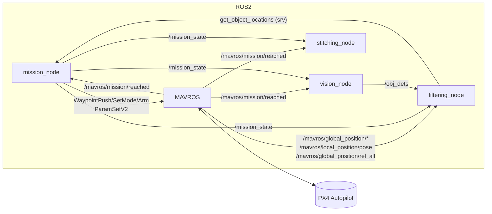
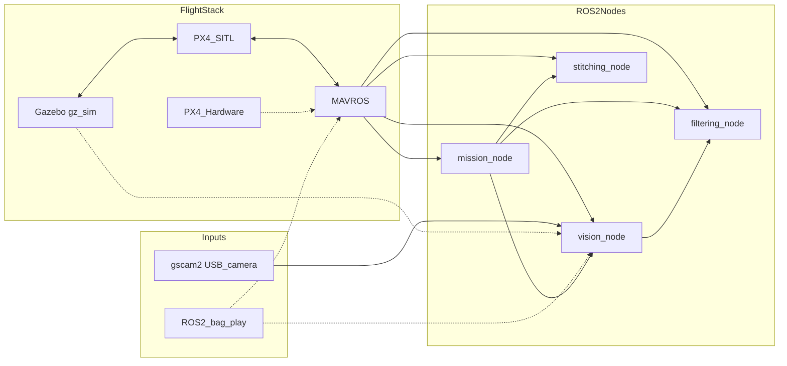
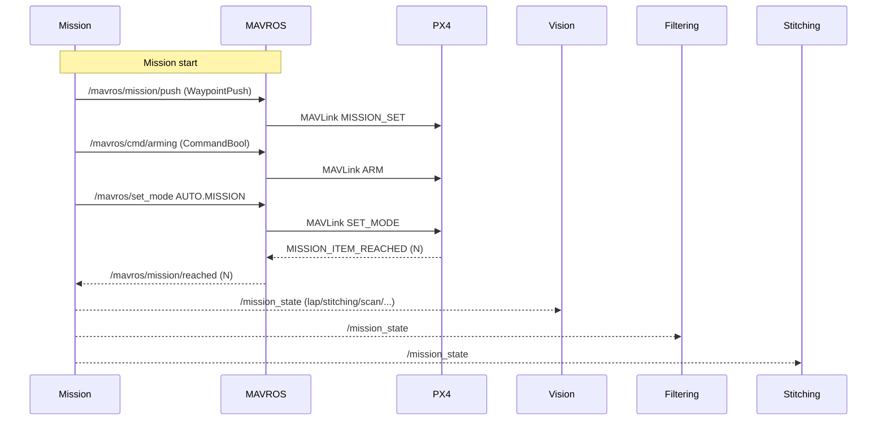

# Buckeye Vertical Core (ROS 2)

End-to-end autonomy stack for BV missions: mission control, vision-based detection, geolocation/filtering, and stitching, integrated with PX4 via MAVROS.

## Introduction

This package orchestrates an autonomous mission with PX4:
- Mission node pushes waypoints, arms, and switches to AUTO.MISSION.
- Vision node captures frames during scan legs, runs RF-DETR, and publishes detections.
- Filtering node fuses detections with pose/GPS to estimate object lat/lon and serves them to Mission.
- Stitching node captures images at waypoints to build panoramas.

PX4 communication overview (via MAVROS):



Operating modes: SITL vs. HITL vs. ROS bag



Legend
- Solid lines: typical SITL pipeline (Gazebo + PX4 SITL + MAVROS feeding ROS 2 nodes).
- Dotted lines: swappable alternatives (PX4 Hardware instead of SITL; ROS bag replay for /mavros/* and/or /image_raw; Gazebo camera plugin as an image source).

Mission start sequence with PX4:



## Architecture

High-level services (“microservices”) and data flow:

- mission_node (bv_core.mission.MissionRunner)
	- Publishes: `/mission_state` (std_msgs/String)
	- Subscribes: `/mavros/mission/reached` (mavros_msgs/WaypointReached), `/mavros/state` (mavros_msgs/State), `/mavros/global_position/global` (NavSatFix), `/queue_state` (std_msgs/Int8)
	- Calls services: `/mavros/mission/push` (WaypointPush), `/mavros/cmd/arming` (CommandBool), `/mavros/set_mode` (SetMode), `/mavros/cmd/command` (CommandLong), `/mavros/param/set` (ParamSetV2), `get_object_locations` (bv_msgs/srv/GetObjectLocations)
	- Role: Mission FSM (lap → stitching → scan → deliver → deploy → return). Pushes waypoints from `config/mission_params.yaml`, tunes speed via `MPC_XY_VEL_ALL`, controls servos via PX4 PWM params.

- vision_node (bv_core.vision_node.VisionNode)
	- Publishes: `/obj_dets` (bv_msgs/ObjectDetections), `/queue_state` (std_msgs/Int8)
	- Subscribes: `/image_raw` (sensor_msgs/Image), `/mission_state` (String), `/mavros/mission/reached` (WaypointReached)
	- Role: On scan state, enqueue frames at each reach event, infer with RF-DETR in batches, annotate/save frames, publish detections.

- filtering_node (bv_core.filtering_node.FilteringNode)
	- Provides: `get_object_locations` (bv_msgs/srv/GetObjectLocations)
	- Subscribes: `/obj_dets` (bv_msgs/ObjectDetections), `/mavros/global_position/global` (NavSatFix), `/mavros/global_position/rel_alt` (Float64), `/mavros/local_position/pose` (PoseStamped), `/mission_state` (String)
	- Role: Time-align detections with pose/GPS, project detections to lat/lon using camera intrinsics/orientation, and estimate object locations.

- stitching_node (bv_core.stitching.ImageStitcherNode)
	- Subscribes: `/image_raw`, `/mission_state`, `/mavros/mission/reached`
	- Role: Capture at waypoints (e.g., during stitching state), run OpenCV stitcher, save output panoramas.

- test_servo (bv_core.test_servo.ServoTester)
	- Calls: `/mavros/cmd/command` (CommandLong CMD_DO_SET_SERVO)
	- Role: Quick servo PWM test.

Launch file: `launch/mission.launch.py` starts mission, vision, filtering, and stitching together.

## Setup

Prerequisites (typical dev machine or Jetson):
- ROS 2 (e.g., Humble) with MAVROS installed and GeographicLib datasets.
- PX4 (SITL or hardware) connected to MAVROS.
- Python 3.10+ with CUDA-capable GPU recommended for RF-DETR.

PX4 developer environment setup (Ubuntu):
- https://docs.px4.io/main/en/dev_setup/dev_env_linux_ubuntu.html

Python deps (see `requirements.txt`): supervision, rf-detr (from BV fork), colcon extensions, etc.

Build and install:
1) Source your ROS 2 and MAVROS environment.
2) Install Python packages in your workspace venv if desired.
3) From the workspace root (`bv_ws`): build and source.

Typical commands (adjust distro/paths as needed):
```bash
# From your ROS 2 workspace root (one above src/)
colcon build --packages-select bv_core
source install/setup.bash
```

Configuration files:
- `config/mission_params.yaml`
	- Waypoint lists: `points` (lap), `scan_points`, `stitch_points`, `deliver_points`
	- Velocities/tolerances: `Lap_velocity`, `Scan_velocity`, `Stitch_velocity`, `*_tolerance`
- `config/vision_params.yaml`
	- `batch_size`, `detection_threshold`, `resolution`, `overlap`, `capture_interval`, `num_scan_wp`
- `config/filtering_params.yaml`
	- `c_matrix` (intrinsics 3x3), `dist_coefficients` (k1…k5), `camera_orientation` (mount euler xyz in radians)

PX4 parameters touched by Mission:
- MPC_XY_VEL_ALL (set via `/mavros/param/set`)
- PWM_MAIN_MIN{n} / PWM_MAIN_MAX{n} (used to drive servos to specific PWMs during deploy)

## How to run

Single system run (PX4 + MAVROS already running):
```bash
ros2 launch bv_core mission.launch.py
```

Individual nodes (for testing):
```bash
ros2 run bv_core mission_node
ros2 run bv_core vision_node
ros2 run bv_core filtering_node
ros2 run bv_core stitching_node
```

Recommended PX4 yaw setting before vision/filtering tests:
```bash
ros2 param set /px4 MPC_YAW_MODE 0
```

## Simulation (SITL) and vehicle setup

Environment and build (all terminals):
```bash
cd ~/bv_ws
source /opt/ros/humble/setup.bash
source install/local_setup.bash
colcon build --packages-select bv_core
```

PX4 SITL (from PX4-Autopilot repo root):
```bash
make px4_sitl gz_x500
```

More on Gazebo (gz) simulation configuration and usage:
- https://docs.px4.io/main/en/sim_gazebo_gz/

MAVROS launch for simulation (SITL):
```bash
ros2 launch mavros px4.launch \
	fcu_url:=udp://:14540@localhost:14580 \
	gcs_url:=udp://@localhost:14555
```

MAVROS launch on vehicle (serial FCU):
```bash
ros2 launch mavros px4.launch \
	fcu_url:=serial:///dev/ttyUSB0:921600 \
	gcs_url:=udp://@0.0.0.0:14550
```

Optional: set PX4 home coordinates for SITL before launch:
```bash
export PX4_HOME_LAT=40.0985384
export PX4_HOME_LON=-83.1932462
```

Start the mission stack:
```bash
# single launch
ros2 launch bv_core mission.launch.py

# or run only the mission node
ros2 run bv_core mission_node
```

## Topics, services, and states (quick reference)

- Mission publishes state machine updates on `/mission_state` with values:
	- `lap` → `stitching` → `scan` → `deliver` → `deploy` → `return`
- Vision publishes `/obj_dets` and queue emptiness on `/queue_state` (1=empty/ready, 0=busy)
- Filtering provides `get_object_locations` populated after leaving `scan`
- MAVROS bridges:
	- Topics: `/mavros/mission/reached`, `/mavros/state`, `/mavros/global_position/global`, `/mavros/global_position/rel_alt`, `/mavros/local_position/pose`
	- Services: `/mavros/mission/push`, `/mavros/cmd/arming`, `/mavros/set_mode`, `/mavros/cmd/command`, `/mavros/param/set`

## Test plans and workflows

Vision node quick test:
```bash
ros2 run bv_core vision_node
ros2 topic pub /mission_state std_msgs/String '{data: scan}' -1
ros2 bag play bag_recording_1_0.db3
ros2 topic echo /obj_dets
# Inspect annotated frames in annotated_frames/
```

Filtering node quick test:
```bash
ros2 run bv_core filtering_node
ros2 bag play -r 10.0 full_mission_test_4_0.db3
ros2 topic echo /obj_dets
# Optional: ros2 topic echo /mission_state
```

Stitching node test (captures at waypoints during stitching):
```bash
ros2 run bv_core stitching_node
```

Servo test:
```bash
ros2 run bv_core test_servo
```

Recording helper launch (edit topics/args as needed):
```bash
ros2 launch bv_core record.launch.py
```

## Camera and gscam2 setup

Disable autofocus and set focus (example for /dev/video0):
```bash
sudo v4l2-ctl -d /dev/video0 --set-ctrl=focus_automatic_continuous=0
sudo v4l2-ctl -d /dev/video0 --set-ctrl=focus_absolute=0
```

Preview the camera with GStreamer (choose one):
```bash
gst-launch-1.0 v4l2src device=/dev/video0 io-mode=2 do-timestamp=true \
	! image/jpeg,width=3840,height=2160,framerate=24/1 \
	! jpegdec ! videoconvert ! autovideosink

# With exposure controls
gst-launch-1.0 \
	v4l2src device=/dev/video0 io-mode=2 do-timestamp=true \
		extra-controls="c,auto_exposure=2,exposure_time_absolute=250" \
	! image/jpeg,width=3840,height=2160,framerate=24/1 \
	! jpegdec ! videoconvert ! autovideosink

v4l2-ctl -d /dev/video0 --set-ctrl=auto_exposure=2

gst-launch-1.0 \
	v4l2src device=/dev/video0 io-mode=2 do-timestamp=true \
		extra-controls="c,auto_exposure=1,exposure_time_absolute=1250" \
	! image/jpeg,width=3840,height=2160,framerate=24/1 \
	! jpegdec ! videoconvert ! autovideosink
```

Run gscam2 bridge (pick a config):
```bash
export GSCAM_CONFIG="v4l2src device=/dev/video0 io-mode=2 do-timestamp=true ! image/jpeg,width=4640,height=3480,framerate=8/1 ! jpegdec ! videoconvert"
export GSCAM_CONFIG="v4l2src device=/dev/video0 io-mode=2 do-timestamp=true ! image/jpeg,width=3840,height=2160,framerate=24/1 ! jpegdec ! videoconvert"
ros2 run gscam2 gscam_main -p use_gst_timestamps=true
```

## Recording

Record the camera and flight topics:
```bash
ros2 bag record -o recording \
	/image_raw /camera_info \
	/mavros/local_position/pose /mavros/state \
	/mavros/global_position/global /mavros/global_position/rel_alt
```

Record detections-focused set:
```bash
ros2 bag record -o bag_recording_1 \
	/obj_dets /mission_state /camera_info \
	/mavros/local_position/pose /mavros/state \
	/mavros/global_position/global /mavros/global_position/rel_alt
```

## Multi-terminal quickstart (example)

All terminals:
```bash
cd ~/bv_ws
source /opt/ros/humble/setup.bash
source install/local_setup.bash
```

Terminal 1 — MAVROS to vehicle:
```bash
ros2 launch mavros px4.launch \
	fcu_url:=serial:///dev/ttyUSB0:921600 \
	gcs_url:=udp://@0.0.0.0:14550
```

Terminal 2 — Camera and gscam2:
```bash
sudo v4l2-ctl -d /dev/video0 --set-ctrl=focus_automatic_continuous=0
sudo v4l2-ctl -d /dev/video0 --set-ctrl=focus_absolute=0
export GSCAM_CONFIG="v4l2src device=/dev/video0 io-mode=2 do-timestamp=true ! image/jpeg,width=3840,height=2160,framerate=24/1 ! jpegdec ! videoconvert"
ros2 run gscam2 gscam_main -p use_gst_timestamps=true
```

Terminal 3 — BV mission stack:
```bash
ros2 launch bv_core mission.launch.py
```

Terminal 4 — Recording:
```bash
ros2 bag record -o bag_recording_1 \
	/image_raw /camera_info \
	/mavros/local_position/pose /mavros/state \
	/mavros/global_position/global /mavros/global_position/rel_alt
```

## Troubleshooting

- MAVROS services not available
	- Ensure MAVROS is running and connected to PX4.
	- Check namespace/topic names; this package assumes default `/mavros/*`.

- No detections published
	- Verify `/image_raw` is publishing.
	- Ensure GPU/CUDA available for RF-DETR; adjust `batch_size`/`resolution` to fit memory.

- Object locations empty
	- Locations are finalized after leaving `scan` state; confirm `/mission_state` transitions.
	- Check filtering intrinsics `c_matrix` and `dist_coefficients`.

- Stitching fails
	- Reduce image resolution or enable preprocessing in parameters.

## Maintenance

ROS logs can consume disk space (especially on Jetson). Periodically clear if needed:
```bash
sudo rm -rf ~/.ros/log
```
