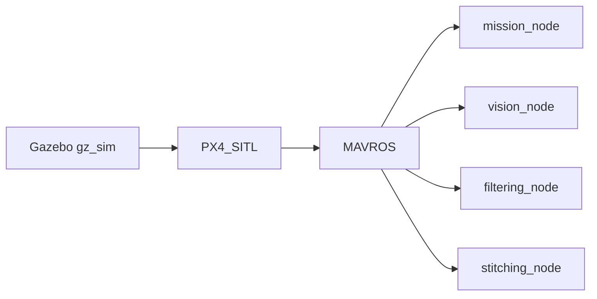
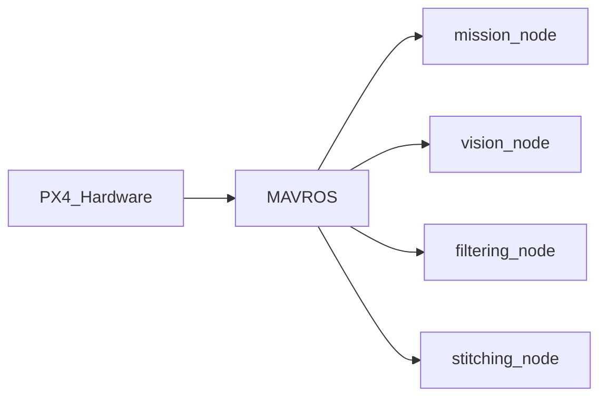
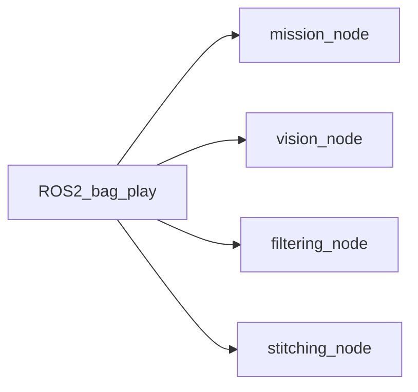
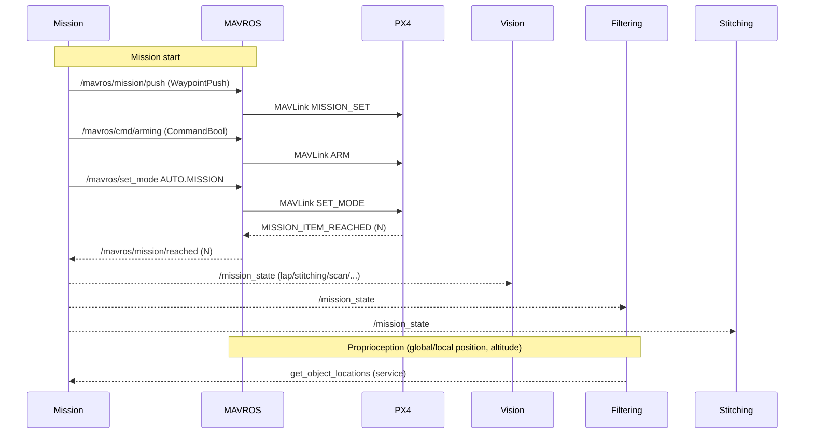

# Buckeye Vertical Core (ROS 2)

End-to-end autonomy stack for BV missions: mission control, vision-based detection, geolocation/filtering, and stitching, integrated with PX4 via MAVROS.

## Introduction

This package orchestrates an autonomous mission with PX4:
- Mission node pushes waypoints, arms, and switches to AUTO.MISSION.
- Vision node captures frames during scan legs, runs RF-DETR, and publishes detections.
- Filtering node fuses detections with pose/GPS to estimate object lat/lon and serves them to Mission.
- Stitching node captures images at waypoints to build an aerial map.

## Project Structure

Below is the project structure. Here we have everything in the ROS workspace directory which we named bv_ws. In ROS this is the common paradigm. The ROS packages should be housed in the src directory. You can name this directory whatever you want.

Note that bv_core (this repo), and [bv_msgs](https://github.com/BuckeyeVertical/bv_msgs) are cloned in the source directory!
```
bv_ws
├── annotated_frames
├── build
├── install
├── log
├── rf-detr-base.pth
└── src
    ├── bv_core
    └── bv_msgs
```

If you need to build packages from source (if sudo apt install if failing), then you should clone their repos in the src directory. Below is an example of building mavros from source.

```
bv_ws
├── annotated_frames
├── build
├── install
├── log
├── rf-detr-base.pth
└── src
    ├── bv_core
    ├── bv_msgs
	├── mavros
    ├── mavros_extras
    ├── mavros_msgs
    └── test_mavros
```


## Architecture

### Nodes and interfaces

High-level services (“microservices”) and data flow:

- mission_node (bv_core.mission.MissionRunner)
	- Publishes: `/mission_state` (std_msgs/String)
	- Subscribes: `/mavros/mission/reached` (mavros_msgs/WaypointReached), `/mavros/state` (mavros_msgs/State), `/mavros/global_position/global` (NavSatFix), `/queue_state` (std_msgs/Int8)
	- Calls services: `/mavros/mission/push` (WaypointPush), `/mavros/cmd/arming` (CommandBool), `/mavros/set_mode` (SetMode), `/mavros/cmd/command` (CommandLong), `/mavros/param/set` (ParamSetV2), `get_object_locations` (bv_msgs/srv/GetObjectLocations)
	- Role: Mission FSM (lap → stitching → scan → deliver → deploy → return). Pushes waypoints from `config/mission_params.yaml`, tunes speed via `MPC_XY_VEL_ALL`, controls servos via PX4 PWM params.

- vision_node (bv_core.vision_node.VisionNode)
	- Publishes: `/obj_dets` (bv_msgs/ObjectDetections), `/queue_state` (std_msgs/Int8)
	- Subscribes: `/image_raw` (sensor_msgs/Image), `/mission_state` (String), `/mavros/mission/reached` (WaypointReached)
	- Role: On scan state, enqueue frames at each reach event, infer with RF-DETR in batches, annotate/save frames, publish detections.

- filtering_node (bv_core.filtering_node.FilteringNode)
	- Provides: `get_object_locations` (bv_msgs/srv/GetObjectLocations)
	- Subscribes: `/obj_dets` (bv_msgs/ObjectDetections), `/mavros/global_position/global` (NavSatFix), `/mavros/global_position/rel_alt` (Float64), `/mavros/local_position/pose` (PoseStamped), `/mission_state` (String)
	- Role: Time-align detections with pose/GPS, project detections to lat/lon using camera intrinsics/orientation, and estimate object locations.

- stitching_node (bv_core.stitching.ImageStitcherNode)
	- Subscribes: `/image_raw`, `/mission_state`, `/mavros/mission/reached`
	- Role: Capture at waypoints (e.g., during stitching state), run OpenCV stitcher, save output panoramas.

- test_servo (bv_core.test_servo.ServoTester)
	- Calls: `/mavros/cmd/command` (CommandLong CMD_DO_SET_SERVO)
	- Role: Quick servo PWM test.

Launch file: `launch/mission.launch.py` starts mission, vision, filtering, and stitching together.

### Operating modes overview

Two inputs feed the ROS 2 nodes: flight data (/mavros/*) and images (/image_raw). The mode you choose controls where those inputs come from.

SITL (simulation) — Gazebo + PX4 SITL + MAVROS


HITL/On-vehicle — PX4 hardware + MAVROS


ROS bag playback — offline analysis/replay


Notes
- In SITL/HITL, images can come from a real camera via gscam2, or from a simulator camera plugin.
- In ROS bag mode, you can replay either full flight+image topics or just images while running MAVROS live.

### Mission flow (PX4 + MAVROS + ROS 2)



## Setup

### Option 1: Linux Method

Prerequisites (Ubuntu 22.04 LTS recommended; typical dev machine or Jetson):
- [ROS 2 Humble](https://docs.ros.org/en/humble/Installation.html)
- [GeographicLib](https://geographiclib.sourceforge.io/C++/doc/index.html)
- [PX4_Autopilot](https://docs.px4.io/main/en/dev_setup/dev_env_linux_ubuntu.html)
- download Render_CAD.stl into meshes/ folder [Render_CAD.STL](https://buckeyemailosu-my.sharepoint.com/:u:/g/personal/clute_25_buckeyemail_osu_edu/EcOCPRC-NQFAmV3IplgyZxwBzP3rijvungflwU5AE4Jchw?e=PTFW1S)
- Python 3.10+ with CUDA-capable GPU recommended for RF-DETR.

Install python deps (setup a venv... I recommend uv):
```bash
pip install -r requirements.txt
```
In the root of your ROS workspace (~/bv_ws) run:
```bash
git clone https://github.com/BuckeyeVertical/rf-detr.git
cd rf-detr
pip install -e .
```

Install mavros:
```bash
sudo apt install ros-humble-mavros
```
*Note: If MAVROS installation doesn't work, you can build it from source by cloning the MAVROS package into your ros workspace.*

Build and install:
1) Source your ROS 2 and MAVROS environment.
2) Install Python packages in your workspace venv if desired.
3) From the workspace root (`bv_ws`): build and source.

Typical commands (adjust distro/paths as needed):
```bash
# From your ROS 2 workspace root (one above src/)
colcon build --packages-select bv_core
source install/setup.bash
```

Configuration files:
- `config/mission_params.yaml`
	- Waypoint lists: `points` (lap), `scan_points`, `stitch_points`, `deliver_points`
	- Velocities/tolerances: `Lap_velocity`, `Scan_velocity`, `Stitch_velocity`, `*_tolerance`
- `config/vision_params.yaml`
	- `batch_size`, `detection_threshold`, `resolution`, `overlap`, `capture_interval`, `num_scan_wp`
- `config/filtering_params.yaml`
	- `c_matrix` (intrinsics 3x3), `dist_coefficients` (k1…k5), `camera_orientation` (mount euler xyz in radians)

PX4 parameters touched by Mission:
- MPC_XY_VEL_ALL (set via `/mavros/param/set`)
- PWM_MAIN_MIN{n} / PWM_MAIN_MAX{n} (used to drive servos to specific PWMs during deploy)

### Option 2: Docker Method

Follow these steps from the workspace root (`bv_ws`) to build and run the Docker development image:
Prereq: Install and set up Docker Desktop and leave the application open

1. Create the directories and clone the packages into `src`:

```bash
cd ~/bv_ws
mkdir src
cd src
# clone the two repos into src
git clone https://github.com/BuckeyeVertical/bv_core.git
git clone https://github.com/BuckeyeVertical/bv_msgs.git
```

3. Build the image from the workspace root:
```bash
cd ~/bv_ws/src/bv_core/container
docker build -f Dockerfile.<ARCH> -t <IMAGE_NAME>:<TAG> .
```

For arm:
```bash
docker build -f Dockerfile.arm -t bv_img:arm .
```

For x86:
```bash
docker build -f Dockerfile.x86 -t bv_img:x86 .
```

4. Run the container interactively:
```bash
./run_docker.sh <IMAGE_NAME>
```

## How to run

Single system run (PX4 + MAVROS already running):
```bash
ros2 launch bv_core mission.launch.py
```

Individual nodes (for testing):
```bash
ros2 run bv_core mission_node
ros2 run bv_core vision_node
ros2 run bv_core filtering_node
ros2 run bv_core stitching_node
```
Download a rosbag from the [onedrive folder](https://buckeyemailosu.sharepoint.com/:f:/s/BuckeyeVerticaltheOhioStateUniversity/EjHddej_GGVGv54oig7Kb9QBrhaEMFVCkAXSl5aEFiD1Lw?e=GxnkYa)

```bash
ros2 bag play <bag_path>
```

[*Learn more about ros bags.*](https://docs.ros.org/en/foxy/Tutorials/Beginner-CLI-Tools/Recording-And-Playing-Back-Data/Recording-And-Playing-Back-Data.html)

To run foxglove:
```bash
ros2 launch foxglove_bridge foxglove_bridge_launch.xml port:=8765
```

## Simulation (SITL) and vehicle setup

Environment and build (all terminals):
```bash
cd ~/bv_ws
source /opt/ros/humble/setup.bash
source install/local_setup.bash
colcon build
```

PX4 SITL (from PX4-Autopilot repo root):
```bash
make px4_sitl gz_x500
```

More on Gazebo (gz) simulation configuration and usage:
- https://docs.px4.io/main/en/sim_gazebo_gz/

MAVROS launch for simulation (SITL):
```bash
ros2 launch mavros px4.launch \
	fcu_url:=udp://:14540@localhost:14580 \
	gcs_url:=udp://@localhost:14555
```

MAVROS launch on vehicle (serial FCU):
```bash
ros2 launch mavros px4.launch \
	fcu_url:=serial:///dev/ttyUSB0:921600 \
	gcs_url:=udp://@0.0.0.0:14550
```

Optional: set PX4 home coordinates for SITL before launch:
```bash
export PX4_HOME_LAT=40.0985384
export PX4_HOME_LON=-83.1932462
```

Start the mission stack:
```bash
# single launch
ros2 launch bv_core mission.launch.py

# or run only the mission node
ros2 run bv_core mission_node
```

## Topics, services, and states (quick reference)

- Mission publishes state machine updates on `/mission_state` with values:
	- `lap` → `stitching` → `scan` → `deliver` → `deploy` → `return`
- Vision publishes `/obj_dets` and queue emptiness on `/queue_state` (1=empty/ready, 0=busy)
- Filtering provides `get_object_locations` populated after leaving `scan`
- MAVROS bridges:
	- Topics: `/mavros/mission/reached`, `/mavros/state`, `/mavros/global_position/global`, `/mavros/global_position/rel_alt`, `/mavros/local_position/pose`
	- Services: `/mavros/mission/push`, `/mavros/cmd/arming`, `/mavros/set_mode`, `/mavros/cmd/command`, `/mavros/param/set`

## Test plans and workflows

Vision node quick test:
```bash
ros2 run bv_core vision_node
ros2 topic pub /mission_state std_msgs/String '{data: scan}' -1
ros2 bag play bag_recording_1_0.db3
ros2 topic echo /obj_dets
# Inspect annotated frames in annotated_frames/
```

Filtering node quick test:
```bash
ros2 run bv_core filtering_node
ros2 bag play -r 10.0 full_mission_test_4_0.db3
ros2 topic echo /obj_dets
# Optional: ros2 topic echo /mission_state
```

Stitching node test (captures at waypoints during stitching):
```bash
ros2 run bv_core stitching_node
```

Servo test:
```bash
ros2 run bv_core test_servo
```

Recording helper launch (edit topics/args as needed):
```bash
ros2 launch bv_core record.launch.py
```

## Camera and gscam2 setup

Disable autofocus and set focus (example for /dev/video0):
```bash
sudo v4l2-ctl -d /dev/video0 --set-ctrl=focus_automatic_continuous=0
sudo v4l2-ctl -d /dev/video0 --set-ctrl=focus_absolute=0
```

Preview the camera with GStreamer (choose one):
```bash
gst-launch-1.0 v4l2src device=/dev/video0 io-mode=2 do-timestamp=true \
	! image/jpeg,width=3840,height=2160,framerate=24/1 \
	! jpegdec ! videoconvert ! autovideosink

# With exposure controls
gst-launch-1.0 \
	v4l2src device=/dev/video0 io-mode=2 do-timestamp=true \
		extra-controls="c,auto_exposure=2,exposure_time_absolute=250" \
	! image/jpeg,width=3840,height=2160,framerate=24/1 \
	! jpegdec ! videoconvert ! autovideosink

v4l2-ctl -d /dev/video0 --set-ctrl=auto_exposure=2

gst-launch-1.0 \
	v4l2src device=/dev/video0 io-mode=2 do-timestamp=true \
		extra-controls="c,auto_exposure=1,exposure_time_absolute=1250" \
	! image/jpeg,width=3840,height=2160,framerate=24/1 \
	! jpegdec ! videoconvert ! autovideosink
```

Run gscam2 bridge (pick a config):
```bash
export GSCAM_CONFIG="v4l2src device=/dev/video0 io-mode=2 do-timestamp=true ! image/jpeg,width=4640,height=3480,framerate=8/1 ! jpegdec ! videoconvert"
export GSCAM_CONFIG="v4l2src device=/dev/video0 io-mode=2 do-timestamp=true ! image/jpeg,width=3840,height=2160,framerate=24/1 ! jpegdec ! videoconvert"
ros2 run gscam2 gscam_main -p use_gst_timestamps=true
```

## Recording

Record the camera and flight topics:
```bash
ros2 bag record -o recording \
	/image_raw /camera_info \
	/mavros/local_position/pose /mavros/state \
	/mavros/global_position/global /mavros/global_position/rel_alt
```

Record detections-focused set:
```bash
ros2 bag record -o bag_recording_1 \
	/obj_dets /mission_state /camera_info \
	/mavros/local_position/pose /mavros/state \
	/mavros/global_position/global /mavros/global_position/rel_alt
```

## Multi-terminal quickstart (example)

All terminals:
```bash
cd ~/bv_ws
source /opt/ros/humble/setup.bash
source install/local_setup.bash
```

Terminal 1 — MAVROS to vehicle:
```bash
ros2 launch mavros px4.launch \
	fcu_url:=serial:///dev/ttyUSB0:921600 \
	gcs_url:=udp://@0.0.0.0:14550
```

Terminal 2 — Camera and gscam2:
```bash
sudo v4l2-ctl -d /dev/video0 --set-ctrl=focus_automatic_continuous=0
sudo v4l2-ctl -d /dev/video0 --set-ctrl=focus_absolute=0
export GSCAM_CONFIG="v4l2src device=/dev/video0 io-mode=2 do-timestamp=true ! image/jpeg,width=3840,height=2160,framerate=24/1 ! jpegdec ! videoconvert"
ros2 run gscam2 gscam_main -p use_gst_timestamps=true
```

Terminal 3 — BV mission stack:
```bash
ros2 launch bv_core mission.launch.py
```

Terminal 4 — Recording:
```bash
ros2 bag record -o bag_recording_1 \
	/image_raw /camera_info \
	/mavros/local_position/pose /mavros/state \
	/mavros/global_position/global /mavros/global_position/rel_alt
```

## Troubleshooting

- MAVROS services not available
	- Ensure MAVROS is running and connected to PX4.
	- Check namespace/topic names; this package assumes default `/mavros/*`.

- No detections published
	- Verify `/image_raw` is publishing.
	- Ensure GPU/CUDA available for RF-DETR; adjust `batch_size`/`resolution` to fit memory.

- Object locations empty
	- Locations are finalized after leaving `scan` state; confirm `/mission_state` transitions.
	- Check filtering intrinsics `c_matrix` and `dist_coefficients`.

- Stitching fails
	- Reduce image resolution or enable preprocessing in parameters.

## Maintenance

ROS logs can consume disk space (especially on Jetson). Periodically clear if needed:
```bash
sudo rm -rf ~/.ros/log
```
